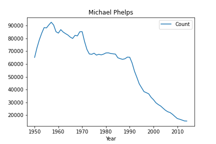
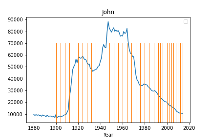
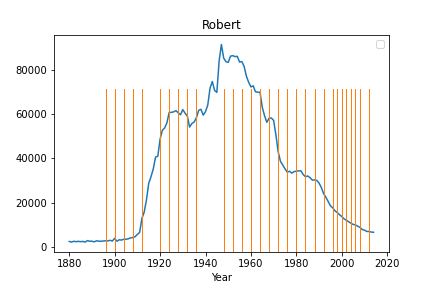

# <ins> Olympic Baby Names</ins>
**Gold Medal Babies: a Predictive Analysis for Winning Names**  
**Client Ask:**  
A company that makes personalized souvenirs and keepsakes:
We want a predictive model that tells us which names to produce.  Do Olympic sports have an effect on the popularity of baby names?

 

**Literature Review:**    
Especially important if it were an Olympic year.  This company wishes to sell custom name novelties.  
## Project:  
The goal is to analyze historical rise and fall in US baby names over time and determine correlations between the relative popularity of baby names and the names of winning Olympic athletes. 

**Key Questions:**  

•	How long does the effect of winning a gold medal last as it relates to baby names?  
o	Prediction: only one year of influence  
•	Topline Graphs of some Famous Olympians: Kristi Yamaguchi, Apolo Ohno, Michael Phelps, Jesse Owens. 

   

## Methodology

**Extract:**  
Downloaded Kaggle .csv files for popular US baby names over the last century, and Olympic winners across the last century for both summer and winter sports.  These were loaded into a pandas data frame.

**Transform:**  
After adding a column designating their respective seasons (winter vs. summer), winter and summer Olympic data frames were aggregated and the years were trimmed to drop any years in which baby names and Olympic winners were not both available.  This trim leaves a data frame from 1896-2015.  Because not all naming conventions are consistent with a “Last, First” format, athletes were dropped when their first names could not be determined—for example, athletes with “Last, first initial.” format.  This was accomplished by creating an Initial and First name column: the initial column was then used to drop data rows where only an initial was provided for the name.

**Load:**  
Baby name and athlete data will be loaded into a postgreSQL database via pgAdmin.  Schemas were created for the Baby Name and Olympic Winners data frames,and they were connected by first name as a key.

## Findings

**Decide on Your Baby's Name the _Right_ Way:**
We found that these were the names that most commonly won olympic medals. If you want your child to win an olympic medal, these are the names you MUST choose from. John obviously has the edge when it comes to men, but the field is a bit tighter for women. 

Here is the popularity of those names over the entire data set. We have put bars across the image for each time someone with that given name has won an olympic medal. By and large, there is no clear correlation between the names of olympic atheletes and the popularity of their given names. 

         

